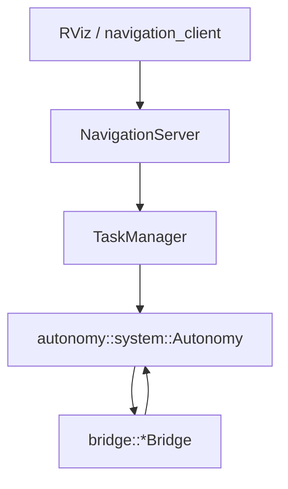

# autonomy_ros

面向 **ROS 2 自主导航** 的 colcon 工作区：`autonomy` 核心导航栈 + `autonomy_ros` ROS 桥接 + TurtleBot3 仿真 + `autonomy_msgs` 对外接口。

仿真资源在 **`autonomy_simulator`** 包（源自 [nav2_minimal_tb3_sim](https://github.com/ros-navigation/nav2_minimal_turtlebot_simulation/tree/main/nav2_minimal_tb3_sim)）。

---

## 功能概览

| 能力 | 说明 |
|------|------|
| 仿真 | Gazebo TB3 Waffle、激光、里程计；可选 fake 差速小车 |
| 导航栈 | `autonomy::system::Autonomy` + 可选行为树 `TaskScheduler` |
| ROS 集成 | `autonomy_ros::system::RosAutonomySystem` 组装 bridge / navigation / viz |
| 对外接口 | `NavigatePose`、`NavigateThrough` + 任务控制 Service |

---

## 工程结构

```
autonomy_ros/                         # workspace 的 src/ 根
├── autonomy_msgs/                    # 导航 Action / Service / 状态消息
├── autonomy_simulator/               # Gazebo + fake 机器人
└── autonomy_ros/                     # 主功能包
    ├── include/autonomy_ros/
    │   ├── system/                   # RosAutonomySystem、options、constants
    │   ├── bridge/                   # TF / 地图 / 传感器 / cmd_vel
    │   ├── navigation/               # NavigationServer、TaskManager、TaskMuxer
    │   ├── viz/                      # /plan、goal、robot_pose
    │   ├── debug/                    # /diagnostics
    │   └── conversions/              # ROS ↔ commsgs（导航子集）
    ├── config/
    │   ├── parameters.yaml           # 节点默认参数
    │   ├── navigation_tasks.json     # CLI 命名位姿与任务
    │   └── navigate_through_goal.json
    ├── launch/navigation_stack.launch.py
    ├── scripts/navigation_client.py
    ├── rviz/autonomy.rviz
    └── docs/                         # 详细文档（见下）
```

---

## 文档

| 文档 | 内容 |
|------|------|
| [docs/architecture.md](autonomy_ros/docs/architecture.md) | 模块分层与数据流 |
| [docs/external_commands.md](autonomy_ros/docs/external_commands.md) | Action / Service / Topic 字段与示例 |
| [docs/navigation_client.md](autonomy_ros/docs/navigation_client.md) | `navigation_client.py` 用法 |
| [docs/localization.md](autonomy_ros/docs/localization.md) | `map` / `odom` 与定位 |
| [docs/conversions.md](autonomy_ros/docs/conversions.md) | ROS ↔ commsgs 转换 |
| [autonomy_msgs/README.md](autonomy_msgs/README.md) | 消息包定义 |

---

## 依赖与编译

```bash
sudo apt update
sudo apt install -y \
  ros-${ROS_DISTRO}-ros-gz-sim \
  ros-${ROS_DISTRO}-ros-gz-bridge \
  ros-${ROS_DISTRO}-ros-gz-interfaces \
  ros-${ROS_DISTRO}-robot-state-publisher \
  ros-${ROS_DISTRO}-rviz2 \
  ros-${ROS_DISTRO}-xacro

cd /path/to/your_ws
colcon build --symlink-install --packages-up-to autonomy autonomy_simulator autonomy_ros
source install/setup.bash
```

---

## 启动

### 完整栈（仿真 + 导航 + 可选 RViz）

```bash
ros2 launch autonomy_ros navigation_stack.launch.py
ros2 launch autonomy_ros navigation_stack.launch.py use_rviz:=true
```

Launch 参数：

| 参数 | 默认 | 说明 |
|------|------|------|
| `simulation_mode` | `gazebo` | `gazebo` 或 `fake` |
| `use_sim_time` | `true` | 仿真时钟 |
| `use_rviz` | `false` | 启动 RViz |
| `core_config_directory` | 自动解析 | 含 `autonomy.lua` 的目录 |

### Fake 机器人 + 导航栈

```bash
ros2 launch autonomy_ros navigation_stack.launch.py \
  simulation_mode:=fake use_sim_time:=false
```

Fake 模式建议将 `config/parameters.yaml` 中 `autonomy.enable_scan_bridge` 设为 `false`，`autonomy.planner.global_frame` 保持 `odom`。

### 仅仿真（不含导航栈）

```bash
ros2 launch autonomy_simulator tb3_simulator.launch.py
ros2 launch autonomy_simulator fake_robot.launch.py
```

---

## 配置

默认参数文件：`autonomy_ros/config/parameters.yaml`。

| 参数 | 默认 | 说明 |
|------|------|------|
| `autonomy.use_bt_navigation` | `true` | 行为树导航；`false` 为 plan + 跟踪 |
| `autonomy.planner.global_frame` | `odom` | 规划坐标系 |
| `autonomy.enable_scan_bridge` | `true` | 订阅 `/scan` 写入代价地图 |
| `autonomy.publish_costmaps` | `true` | 发布 global/local costmap |
| `navigation.waypoint_timeout_sec` | `120.0` | 单点/路点超时 |
| `navigation.goal_pose_topic` | `goal_pose` | RViz 2D Goal 话题 |

---

## 对外接口（`/autonomy/*`）

### Action

| 名称 | 说明 |
|------|------|
| `/autonomy/navigate_pose` | 单点导航 |
| `/autonomy/navigate_through` | 顺序途经多点 |

### Service

| 名称 | 说明 |
|------|------|
| `/autonomy/cancel_task` | 取消任务 |
| `/autonomy/get_task_status` | 查询状态 |
| `/autonomy/pause_task` / `resume_task` | 暂停 / 恢复 |
| `/autonomy/trigger_estop` | 急停 |
| `/autonomy/set_initial_pose` | 重定位 |

### 状态 Topic

| 名称 | 类型 |
|------|------|
| `/autonomy/status` | `autonomy_msgs/msg/TaskStatus` |
| `/autonomy/events` | `autonomy_msgs/msg/Event` |

### CLI 示例

```bash
ros2 run autonomy_ros navigation_client.py list-tasks
ros2 run autonomy_ros navigation_client.py run-task go_to_point_a --feedback
ros2 run autonomy_ros navigation_client.py navigate-pose --x 1.0 --y 0.5 --feedback
```

### RViz

- **2D Goal Pose** → `goal_pose`：触发单点导航（可抢占当前 Action）
- **2D Pose Estimate** → `initialpose`：经 `NavigationServer` 转发重定位

---

## 架构概览



| 模块 | 命名空间 | 职责 |
|------|----------|------|
| `RosAutonomySystem` | `autonomy_ros::system` | 启动 core，组装 bridge / navigation / viz |
| `NavigationServer` | `autonomy_ros::navigation` | Action、Service、RViz 话题 |
| `TaskManager` | `autonomy_ros::navigation` | 任务状态，调用 core 导航 |
| `*Bridge` | `autonomy_ros::bridge` | TF、地图、传感器、cmd_vel、costmap |
| `Visualizer` | `autonomy_ros::viz` | `/plan`、目标与位姿 |

---

## 仿真传感器 Topic

| Topic | 类型 |
|-------|------|
| `/scan` | `sensor_msgs/LaserScan` |
| `/odom` | `nav_msgs/Odometry` |
| `/cmd_vel` | `geometry_msgs/TwistStamped`（订阅） |

TF 链：`odom` → `base_footprint` → `base_link` → `base_scan`。

---

## 当前限制

- 默认在 **odom** 系规划；全局地图避障需自行接入定位并将 `global_frame` 设为 `map`。
- Action 中 `behavior_tree` 字段为预留；非空返回 `NAV_GOAL_INVALID`（默认 BT 在 core 的 tasks lua 配置）。
- 同一时刻仅一个导航任务；`WAYPOINTS` 优先级高于 `NAVIGATION`。

---

## 致谢

- 仿真：[nav2_minimal_turtlebot_simulation](https://github.com/ros-navigation/nav2_minimal_turtlebot_simulation)（Apache-2.0）
- 接口参考：[nav2_msgs](https://github.com/ros-navigation/navigation2/tree/main/nav2_msgs)
