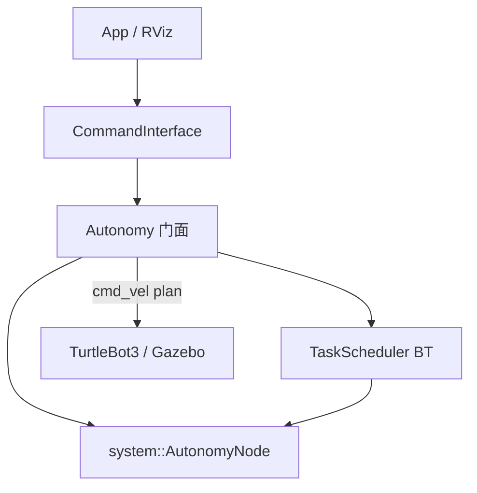

# autonomy_ros

面向**展厅讲解机器人**的 ROS 2 工作区：TurtleBot3 Gazebo 仿真 + 模块化自主栈 + 对外任务接口（`autonomy_msgs`）。

仿真资源在 **`autonomy_simulator`** 包（源自 [nav2_minimal_tb3_sim](https://github.com/ros-navigation/nav2_minimal_turtlebot_simulation/tree/main/nav2_minimal_tb3_sim)），无需单独 clone 仿真仓库。

---

## 功能概览

| 能力 | 说明 |
|------|------|
| 仿真 | Gazebo 单台 TB3 Waffle、激光、里程计、RealSense D435i |
| 导航栈 | `Autonomy` 门面 + 核心 `AutonomyNode` + 可选 BT `TaskScheduler` |
| 对外指令 | `autonomy_msgs` 的 Action / Service / Topic |
| 展厅导览 | `GuidedTour`：多展点 + 讲解 ID + 等待观众 |

---

## 工程结构

```
autonomy_ros/                    # 仓库根（colcon workspace 的 src 目录）
├── autonomy_msgs/               # 对外 API 定义，详见 autonomy_msgs/README.md
├── autonomy_simulator/          # Gazebo 仿真（worlds / urdf / models / launch）
│   ├── launch/tb3_simulator.launch.py
│   └── README.md
├── autonomy_ros/                # 主功能包（导航栈 ROS 桥接）
│   ├── include/autonomy_ros/
│   ├── docs/architecture.md
│   ├── launch/autonomy_stack.launch.py
│   ├── config/autonomy_params.yaml
│   ├── rviz/autonomy.rviz
│   └── CMakeLists.txt
└── README.md
```

---

## 软件架构

详细分层、数据流与 BT 附着说明见 **[autonomy_ros/docs/architecture.md](autonomy_ros/docs/architecture.md)**。



| 模块 | 职责 |
|------|------|
| **Autonomy** | 唯一核心入口：配置、`AutonomyNode`、ROS 桥接、附着 `TaskScheduler` |
| **command** | `autonomy_msgs` Action / Service / `init_pose` / `goal_pose` |
| **task** | 任务状态、`autonomy/status`、`autonomy/events` |
| **visualization** | RViz Marker |

---

## 依赖

```bash
# 以 Jazzy/Humble 为例，请替换 $ROS_DISTRO
sudo apt update
sudo apt install -y \
  ros-${ROS_DISTRO}-ros-gz-sim \
  ros-${ROS_DISTRO}-ros-gz-bridge \
  ros-${ROS_DISTRO}-ros-gz-interfaces \
  ros-${ROS_DISTRO}-robot-state-publisher \
  ros-${ROS_DISTRO}-rviz2 \
  ros-${ROS_DISTRO}-xacro
```

---

## 编译

```bash
cd /path/to/your_ws
# 将本仓库置于 src/ 下，例如 src/autonomy_ros
colcon build --symlink-install --packages-up-to autonomy autonomy_simulator autonomy_ros
source install/setup.bash
```

---

## 启动

### 完整栈（推荐）

仿真 + 自主栈 + RViz：

```bash
ros2 launch autonomy_ros autonomy_stack.launch.py
```

### 仅仿真

```bash
# Gazebo
ros2 launch autonomy_simulator tb3_simulator.launch.py
ros2 launch autonomy_simulator tb3_simulator.launch.py headless:=True

# Fake 机器人（无 Gazebo，参考 turtlebot3_fake_node）
ros2 launch autonomy_simulator fake_robot.launch.py
```

### Fake + 完整栈

```bash
ros2 launch autonomy_ros autonomy_stack.launch.py sim_mode:=fake use_sim_time:=false
```

### 模块开关

编辑 `autonomy_ros/config/autonomy_params.yaml`：

| 参数 | 默认 | 说明 |
|------|------|------|
| `enable_autonomy` | true | 启动核心栈（`Autonomy`） |
| `enable_visualization` | true | RViz 标记 |
| `enable_command` | true | 对外 Action/Srv（需 `enable_autonomy`） |
| `autonomy.use_bt_navigation` | true | `NavigatePose` 使用行为树（共享 planner/controller） |

---

## 对外接口（`autonomy/*`）

- **命令说明（Action / Service 字段与示例）**：[autonomy_ros/docs/external_commands.md](autonomy_ros/docs/external_commands.md)
- **消息定义**： [autonomy_msgs/README.md](autonomy_msgs/README.md)

### Action（长时任务）

| Action | 用途 |
|--------|------|
| `/autonomy/guided_tour` | **展厅导览**（主流程） |
| `/autonomy/navigate_pose` | 单点导航 |
| `/autonomy/navigate_through` | 多点导航 |
| `/autonomy/follow` | 跟随 |
| `/autonomy/dock` | 回充 |
| `/autonomy/teleop` | 遥操会话 |

### Service（短时命令）

| Service | 用途 |
|---------|------|
| `/autonomy/continue_tour` | 展点讲解后「下一步」 |
| `/autonomy/pause_task` / `resume_task` | 暂停 / 继续 |
| `/autonomy/skip_to_exhibit` | 跳过展点 |
| `/autonomy/cancel_task` | 取消任务 |
| `/autonomy/get_task_status` | 查询状态 |
| `/autonomy/trigger_estop` | 急停 |
| `/autonomy/set_initial_pose` | 重定位 |
| `/autonomy/set_teleop_mode` | 开关遥操 |
| `/autonomy/list_docks` | 充电桩列表 |

### Topic

| Topic | 类型 |
|-------|------|
| `/autonomy/status` | `autonomy_msgs/msg/TaskStatus` |
| `/autonomy/events` | `autonomy_msgs/msg/Event` |
| `/autonomy/battery` | `autonomy_msgs/msg/BatteryStatus` |

### 示例：查询状态

```bash
ros2 topic echo /autonomy/status
ros2 service call /autonomy/get_task_status autonomy_msgs/srv/GetTaskStatus "{}"
```

### 示例：RViz 手动目标（调试）

在 RViz 用 **2D Goal Pose** 发布到 `/goal_pose`，可走 planner → controller 链路（不经过 Action）。

---

## 仿真传感器 Topic

| Topic | 类型 |
|-------|------|
| `/scan` | `sensor_msgs/LaserScan` |
| `/odom` | `nav_msgs/Odometry` |
| `/imu` | `sensor_msgs/Imu` |
| `/cmd_vel` | `geometry_msgs/TwistStamped`（订阅） |
| `/camera/camera/color/image_raw` | `sensor_msgs/Image` |
| `/camera/camera/depth/image_rect_raw` | `sensor_msgs/Image` |
| `/camera/camera/depth/color/points` | `sensor_msgs/PointCloud2` |

主要 TF：`odom` → `base_footprint` → `base_link` → `base_scan` / `camera_*`。

---

## 展厅导览协作流程

```
中控下发 GuidedTour
  → 机器人导航至展点
  → /autonomy/events 发布 ARRIVED_AT_EXHIBIT（含 narration_id）
  → 播控/TTS 播放讲解
  → wait_for_continue 时调用 continue_tour，或 dwell 超时自动下一站
  → 重复直至 TOUR_COMPLETED
  → 可选自动 Dock 回充
```

---

## 当前限制

- 规划为 **odom 系直线骨架**，无全局地图避障（未使用 `/map` 做碰撞检测）。
- `Follow` 的 `target_id` 跟踪未实现，仅支持 `use_target_pose`。
- `behavior_tree` 等 Nav2 专用字段为预留，当前忽略。
- Action 在独立线程执行；**TaskMuxer** 按优先级仲裁，高优先级可抢占低优先级任务。

---

## 致谢

- 仿真模型：[nav2_minimal_turtlebot_simulation](https://github.com/ros-navigation/nav2_minimal_turtlebot_simulation)（Apache-2.0）
- 接口设计参考：[nav2_msgs](https://github.com/ros-navigation/navigation2/tree/main/nav2_msgs)
