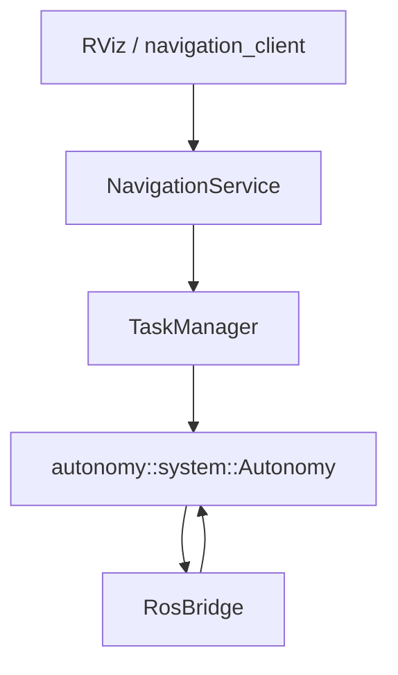

# autonomy_ros

A **ROS 2 autonomous navigation** colcon workspace: the `autonomy` core stack, `autonomy_ros` ROS bridge, TurtleBot3 simulation, and `autonomy_msgs` public API.

Simulation assets live in **`autonomy_simulator`** (based on [nav2_minimal_tb3_sim](https://github.com/ros-navigation/nav2_minimal_turtlebot_simulation/tree/main/nav2_minimal_tb3_sim)).

---

## Overview

| Capability | Description |
|------------|-------------|
| Simulation | Gazebo TB3 Waffle with lidar and odometry; optional fake diff-drive robot |
| Navigation | `autonomy::system::Autonomy` + optional behavior-tree `TaskScheduler` |
| ROS integration | `autonomy_ros::RosAutonomySystem` wires bridge / server / manager / viz |
| Public API | `NavigatePose`, `NavigateThrough`, and task-control services |

---

## Repository layout

```
autonomy_ros/                         # src/ root of the workspace
├── autonomy_msgs/                    # Navigation actions, services, status messages
├── autonomy_simulator/               # Gazebo + fake robot
└── autonomy_ros/                     # Main ROS package
    ├── include/autonomy_ros/
    │   ├── node.hpp                  # RosAutonomySystem
    │   ├── server.hpp                # NavigationService (actions/services)
    │   ├── manager.hpp               # TaskManager
    │   ├── bridge.hpp                # RosBridge
    │   ├── visualizer.hpp
    │   ├── diagnostic.hpp
    │   ├── logger.hpp
    │   ├── options.hpp / constants.hpp
    │   └── conversions/              # ROS ↔ commsgs (navigation subset)
    ├── config/
    │   ├── parameters.yaml           # Default node parameters
    │   ├── navigation_tasks.json     # Named poses and tasks for the CLI
    │   └── navigate_through_goal.json
    ├── launch/navigation_stack.launch.py
    ├── scripts/navigation_client.py
    ├── rviz/autonomy.rviz
    └── docs/                         # Detailed docs (see below)
```

---

## Documentation

| Document | Contents |
|----------|----------|
| [docs/architecture.md](autonomy_ros/docs/architecture.md) | Module layers and data flow |
| [docs/external_commands.md](autonomy_ros/docs/external_commands.md) | Action / service / topic fields and examples |
| [docs/navigation_client.md](autonomy_ros/docs/navigation_client.md) | `navigation_client.py` usage |
| [docs/localization.md](autonomy_ros/docs/localization.md) | `map` / `odom` frames and localization |
| [docs/conversions.md](autonomy_ros/docs/conversions.md) | ROS ↔ commsgs conversions |
| [autonomy_msgs/README.md](autonomy_msgs/README.md) | Message package definitions |

---

## Dependencies and build

```bash
sudo apt update
sudo apt install -y \
  ros-${ROS_DISTRO}-ros-gz-sim \
  ros-${ROS_DISTRO}-ros-gz-bridge \
  ros-${ROS_DISTRO}-ros-gz-interfaces \
  ros-${ROS_DISTRO}-robot-state-publisher \
  ros-${ROS_DISTRO}-rviz2 \
  ros-${ROS_DISTRO}-xacro

cd /path/to/your_ws
colcon build --symlink-install --packages-up-to autonomy autonomy_simulator autonomy_ros
source install/setup.bash
```

---

## Launch

### Full stack (simulation + navigation + optional RViz)

```bash
ros2 launch autonomy_ros navigation_stack.launch.py
ros2 launch autonomy_ros navigation_stack.launch.py use_rviz:=true
```

Launch arguments:

| Argument | Default | Description |
|----------|---------|-------------|
| `simulation_mode` | `gazebo` | `gazebo` or `fake` |
| `use_sim_time` | `true` | Use simulation clock |
| `use_rviz` | `false` | Start RViz |
| `core_config_directory` | auto-resolved | Directory containing `autonomy.lua` |

### Fake robot + navigation stack

```bash
ros2 launch autonomy_ros navigation_stack.launch.py \
  simulation_mode:=fake use_sim_time:=false
```

For fake mode, set `autonomy.enable_scan_bridge` to `false` in `config/parameters.yaml` and keep `autonomy.planner.global_frame` as `odom`.

### Simulation only (no navigation stack)

```bash
ros2 launch autonomy_simulator tb3_simulator.launch.py
ros2 launch autonomy_simulator fake_robot.launch.py
```

---

## Configuration

Default parameters: `autonomy_ros/config/parameters.yaml`.

| Parameter | Default | Description |
|-----------|---------|-------------|
| `autonomy.use_bt_navigation` | `true` | Behavior-tree navigation; `false` uses plan + path tracking |
| `autonomy.planner.global_frame` | `odom` | Planning frame |
| `autonomy.enable_scan_bridge` | `true` | Subscribe to `/scan` for the costmap |
| `autonomy.publish_costmaps` | `true` | Publish global/local costmaps |
| `navigation.waypoint_timeout_sec` | `120.0` | Per-goal / per-waypoint timeout |
| `navigation.goal_pose_topic` | `goal_pose` | RViz 2D Goal topic |

---

## Public API

### Actions

| Name | Description |
|------|-------------|
| `/navigate_pose` | Single-goal navigation |
| `/navigate_through` | Sequential multi-waypoint navigation |

### Services

| Name | Description |
|------|-------------|
| `/cancel_task` | Cancel a task |
| `/get_task_status` | Query task status |
| `/pause_task` / `/resume_task` | Pause / resume |
| `/trigger_estop` | Emergency stop |
| `/set_initial_pose` | Set initial pose (localization) |

### Status topics

| Name | Type |
|------|------|
| `/status` | `autonomy_msgs/msg/TaskStatus` |
| `/events` | `autonomy_msgs/msg/Event` |

### CLI examples

```bash
ros2 run autonomy_ros navigation_client.py list-tasks
ros2 run autonomy_ros navigation_client.py run-task go_to_point_a --feedback
ros2 run autonomy_ros navigation_client.py navigate-pose --x 1.0 --y 0.5 --feedback
```

### RViz

- **2D Goal Pose** → `goal_pose`: triggers single-goal navigation (may preempt the current action)
- **2D Pose Estimate** → `initialpose`: forwarded by `NavigationService` for relocalization

---

## Architecture



| Module | Namespace | Role |
|--------|-----------|------|
| `RosAutonomySystem` | `autonomy_ros` | Start core; assemble bridge / service / viz |
| `NavigationService` | `autonomy_ros` | Actions, services, RViz topics |
| `TaskManager` | `autonomy_ros` | Task state and core navigation calls |
| `RosBridge` | `autonomy_ros` | TF, map, sensors, cmd_vel, costmap |
| `Visualizer` | `autonomy_ros` | `/plan`, goal, and robot pose |

---

## Simulation topics

| Topic | Type |
|-------|------|
| `scan` (resolved under node namespace) | `sensor_msgs/LaserScan` |
| `/odom` | `nav_msgs/Odometry` |
| `/cmd_vel` | `geometry_msgs/TwistStamped` (subscribed) |

TF chain: `odom` → `base_footprint` → `base_link` → `base_scan`.

---

## Current limitations

- Planning defaults to the **odom** frame; global map avoidance requires external localization and `global_frame: map`.
- The `behavior_tree` field on actions is reserved; a non-empty value returns `NAV_GOAL_INVALID` (default BT is configured in core tasks lua).
- Only one navigation task at a time; `WAYPOINTS` has higher priority than `NAVIGATION`.

---

## Acknowledgements

- Simulation: [nav2_minimal_turtlebot_simulation](https://github.com/ros-navigation/nav2_minimal_turtlebot_simulation) (Apache-2.0)
- API inspiration: [nav2_msgs](https://github.com/ros-navigation/navigation2/tree/main/nav2_msgs)
