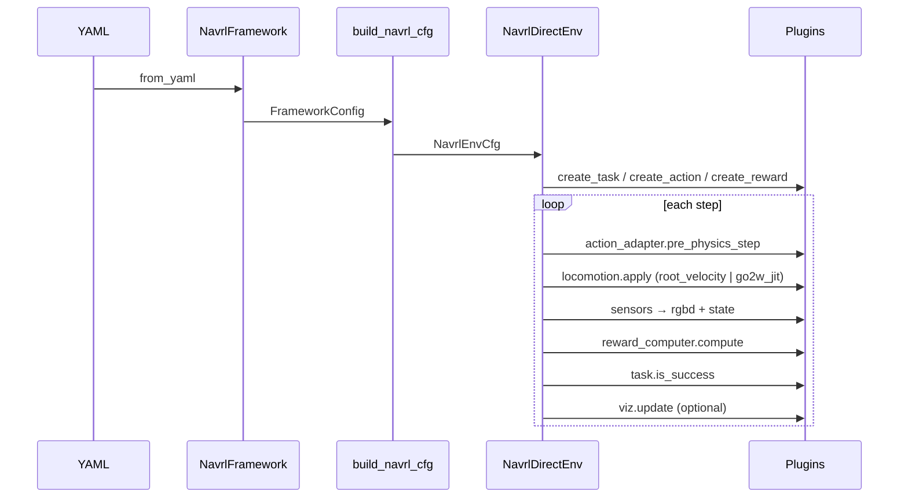

# autonomy_navrl 架构（终极设计）

Isaac Lab **模块化 RL 训练框架**：YAML 参数化 + 插件注册表 + 统一 API。

## 设计原则

| 原则 | 实现 |
|------|------|
| 参数化 | 行为由 YAML 驱动，代码只提供扩展点 |
| **模块化** | 机器人 / 任务 / 动作 / 奖励 / 传感器 / 运控 / 可视化 七类插件 |
| 简洁 API | `NavrlFramework.from_yaml(path).create_env()` |
| 可扩展 | `@registry.register('name')` 即可添加插件，无需改 core |
| 不过度设计 | Registry + dataclass + 单一 DirectRLEnv |

## 解耦合原则

| 层级 | 职责 | 不依赖 |
|------|------|--------|
| `core/` | 配置解析、注册表、协议、校验 | Isaac Sim、具体机器人 |
| `plugins/` | 任务/奖励/运控/机器人扩展 | `DirectRLEnv` 实现细节（仅 TYPE_CHECKING） |
| `plugins/bootstrap.py` | 一次性注册内置插件 | — |
| `plugins/runtime.py` | 从 YAML 构建 curriculum / smoothing | Isaac 场景 |
| `env/isaac/` | Isaac Lab 仿真循环 | 具体 reward 公式（走 registry） |
| `train/` · `deploy/` | 训练与 ROS 部署入口 | 彼此 |

**依赖方向**（单向）：

```
YAML → core → plugins/* → env/isaac/direct_env → train|deploy
```

- 共享算法（采样、body-frame 几何）：`core/sampling.py`、`core/geometry.py`
- JDRobot 奖励/课程/平滑：`plugins/jdrobot/`
- Go2W IoU / consecutive success：`plugins/go2w/`
- Isaac 模块：`env/isaac/__init__.py` 与 `isaac_env.py` **懒加载**，CLI `--list-plugins` 无需 Isaac
- 插件注册入口：`plugins/bootstrap.ensure_plugins()`（幂等）

工程规范详见 [ENGINEERING.md](ENGINEERING.md)。

## 分层架构

```
                    ┌─────────────────────────────────────┐
                    │  train/cli.py  ·  deploy/node.py    │
                    └─────────────────┬───────────────────┘
                                      │
                    ┌─────────────────▼───────────────────┐
                    │  core/api.py   NavrlFramework       │
                    │  core/spec.py  FrameworkConfig      │
                    │  core/catalog  list_plugins()       │
                    │  core/validate validate_framework   │
                    └─────────────────┬───────────────────┘
                                      │
          ┌───────────────────────────┼───────────────────────────┐
          │                           │                           │
┌─────────▼─────────┐     ┌───────────▼──────────┐    ┌──────────▼─────────┐
│ plugins/robots    │     │ plugins/tasks        │    │ plugins/rewards    │
│ plugins/actions   │     │ plugins/sensors      │    │ plugins/locomotion │
│                   │     │                      │    │ viz/isaac/modules  │
└─────────┬─────────┘     └───────────┬──────────┘    └──────────┬─────────┘
          │                           │                           │
          └───────────────────────────┼───────────────────────────┘
                                      │
                    ┌─────────────────▼───────────────────┐
                    │  env/isaac/NavrlDirectEnv           │
                    │  (Isaac Lab DirectRLEnv)            │
                    └─────────────────────────────────────┘
```

## 插件目录

运行 `train_navrl --list-plugins` 查看当前注册项：

| 类别 | 内置插件 |
|------|----------|
| **robot.kind** | `quadruped`, `wheeled_legged`, `humanoid`, `diff_drive` |
| **robot.preset** | `go2w`, `s10`, `humanoid_g1`, `diff_drive_base` |
| **action_model** | `holonomic_3d`, `diff_drive_2d` |
| **task.kind** | `goal_nav`, `precision_pose`, `go2w_precision_pose`, `waypoint_nav` |
| **reward.profile** | `default`, `jdrobot`, `sparse`, `precision_iou` |
| **locomotion.backend** | `root_velocity`, `go2w_jit`, `s10_jit` |
| **viz.modules** | `target_pose_frame`, `robot_heading_arrow`, … |

> 自定义插件注册后**自动**出现在 registry 中，无需修改 `TASK_KINDS` 等常量。

## 公共 API

```python
from autonomy_navrl import NavrlFramework, list_plugins

# 列出插件
print(list_plugins())

# 加载 + 校验 + 创建环境
fw = NavrlFramework.from_yaml('config/go2w.yaml', profile='jit')
print(fw.summary())
assert not fw.validate()
env = fw.create_env(backend='isaac')
```

CLI：

```bash
train_navrl --list-plugins
train_navrl --config config/go2w.yaml --profile jit --dry-run
train_navrl --config config/go2w.yaml --profile jit --backend isaac
```

## 配置 Schema

完整参考：`config/reference.yaml`

```yaml
robot:
  kind: wheeled_legged
  preset: go2w
  urdf_path: /path/to.urdf

control:
  action_model: holonomic_3d   # 或 diff_drive_2d

task:
  kind: precision_pose         # goal_nav | waypoint_nav | 自定义

reward:
  profile: jdrobot             # default | sparse | precision_iou | 自定义

locomotion:
  backend: root_velocity       # go2w_jit | 自定义
  decimation: 4

sensors:
  rgb: {width: 128, height: 96}
  imu: {enabled: true}

viz:
  enabled: true
  modules: [target_pose_frame, robot_heading_arrow]
```

## 环境生命周期



## 机器人 × 动作 × 任务

| robot.kind | action_model | task.kind | 配置 |
|------------|--------------|-----------|------|
| quadruped | holonomic_3d | goal_nav | `s10.yaml` profile `default` |
| wheeled_legged | holonomic_3d | precision_pose | `go2w.yaml` profile `kinematic` |
| wheeled_legged | holonomic_3d | precision_pose + JIT | `go2w.yaml` profile `jit` |
| wheeled_legged | holonomic_3d | waypoint_nav | 见 `reference.yaml` 示例 |
| humanoid | holonomic_3d | goal_nav | 见 `reference.yaml` 示例 |
| diff_drive | diff_drive_2d | goal_nav | 见 `reference.yaml` 示例 |

## 扩展指南

详见 [EXTENDING.md](EXTENDING.md)。

| 扩展 | 步骤 |
|------|------|
| 新任务 | 继承 `BaseTask` → `@task_registry.register` |
| 新动作 | 继承 `BaseActionAdapter` → `@action_registry.register` |
| 新奖励 | 继承 `BaseRewardComputer` → `@reward_registry.register` |
| 新运控 | 继承 `BaseLocomotionController` → `@locomotion_registry.register` |
| 新可视化 | 继承 `PoseVizModule` → 加入 `MODULE_CLASSES` |
| 新机器人 | `ROBOT_PRESETS` + `KIND_DEFAULTS` |

## 观测与状态向量

```
state = [ task_goal_features | imu(9) | odom(6) ]
rgbd  = [ RGB(3) | depth(1) ]  shape (N, C, H, W)
```

- `task_goal_features` 维度因 task 而异（`precision_pose` +1 yaw error，`waypoint_nav` +1 progress）
- `policy.state_dim` 应 ≥ 实际拼接长度（超出部分零填充）

## 向后兼容

- `task.mode: navigate` → `goal_nav`
- v0.4 起移除 `Quadruped*` / `common/` / `sensors/` 别名，见 [STRUCTURE.md](STRUCTURE.md)

## 训练与策略层

MDP（env + plugins）与训练算法解耦：

```text
env.reset/step → obs {rgbd, state}
       ↓
models.factory.create_nav_policy(config)
       ↓
algorithms.factory.create_algorithm(env, config)
       ↓
checkpoint {policy_state_dict, algorithm, policy_type}
```

| 模块 | 职责 |
|------|------|
| `models/encoders/` | RGBD CNN、state MLP、fusion（`concat`） |
| `models/policies/` | `GaussianActorCriticPolicy`（`NavPolicy` 接口） |
| `models/factory.py` | 从 YAML `model:` / `policy:` 构建网络 |
| `algorithms/ppo.py` | PPO 训练循环 |
| `algorithms/registry.py` | `algorithm.name: ppo \| grpo \| diffusion` |
| `policy/` | 已删除，使用 `models/` |

配置示例（`config/reference.yaml`）：

```yaml
algorithm:
  name: ppo
model:
  policy_type: gaussian_actor_critic
  fusion: concat
  encoders:
    rgbd: {type: cnn, channels: [32, 64, 64]}
    state: {type: mlp}
```

## 文件索引

| 路径 | 职责 |
|------|------|
| `core/api.py` | `NavrlFramework` 统一入口 |
| `core/spec.py` | `FrameworkConfig` 解析 |
| `core/registry.py` | 通用注册表 |
| `core/locomotion_spec.py` | `LocomotionSpec` 分层运控配置 |
| `plugins/bootstrap.py` | `ensure_plugins()` 插件注册 |
| `plugins/isaac_sensors.py` | Isaac 传感器 prim + 观测 |
| `core/sampling.py` | 目标/障碍物采样 |
| `core/geometry.py` | body-frame 位姿特征 |
| `core/config_loader.py` | YAML 加载 |
| `preprocessing/` | deploy/mock numpy 观测预处理 |
| `plugins/runtime.py` | curriculum / smoothing 工厂 |
| `plugins/jdrobot/` | JDRobot 奖励、课程、动作平滑 |
| `plugins/go2w/` | Go2W IoU、consecutive success |
| `plugins/locomotion/` | root_velocity / go2w_jit 运控 |
| `plugins/bootstrap.py` | 内置插件 side-effect 注册 |
| `plugins/rewards_extras.py` | sparse 等通用奖励 |
| `env/isaac/direct_env.py` | Isaac MDP 主循环 |
| `models/factory.py` | 策略工厂 |
| `models/encoders/fusion.py` | 多模态融合 |
| `algorithms/ppo.py` | PPO 算法 |
| `algorithms/factory.py` | 算法注册与 `create_algorithm` |
| `config/reference.yaml` | 配置全字段参考 |
