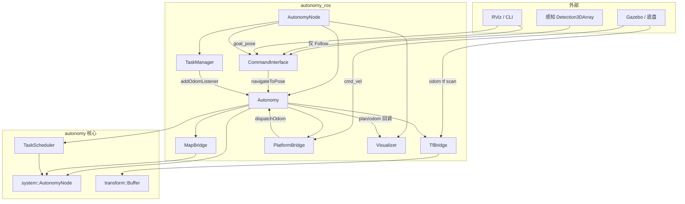
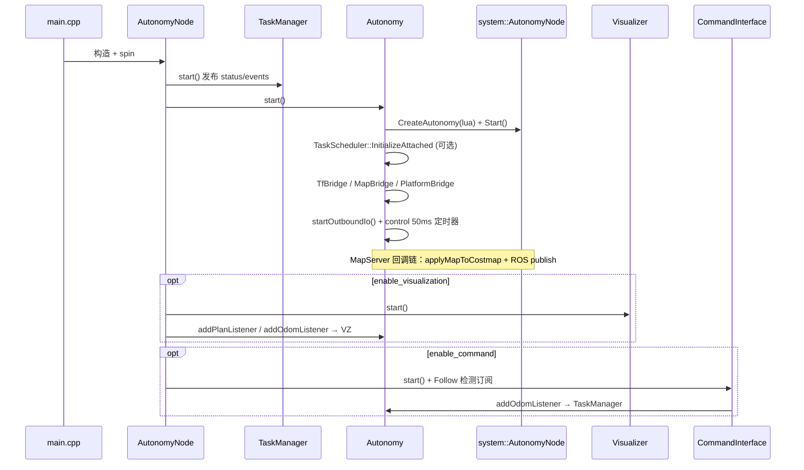
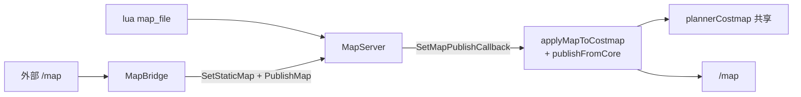
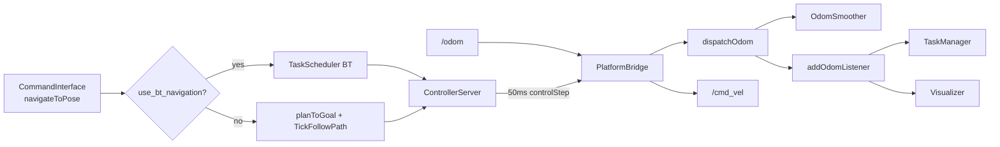
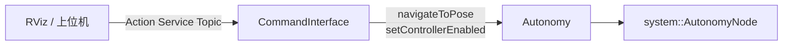
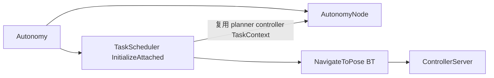

# autonomy_ros 架构

`autonomy_ros` 是 **ROS 2 集成层**：只做话题/服务桥接、外部指令与可选可视化；**规划、控制、代价地图、行为树均在 `autonomy` 核心**，由 `autonomy_ros::Autonomy` 唯一门面调用。

设计原则（重构后）：

- **单节点**：`autonomy_node` 承载全部 ROS 接口。
- **单导航入口**：`Autonomy::navigateToPose()`（BT 或直驱由 `use_bt_navigation` 决定，不再混用两套执行逻辑）。
- **单 odom 入口**：仅 `PlatformBridge` 订阅里程计，经 `dispatchOdom` 分发给核心与 `TaskManager`。
- **单 costmap 写入**：共享 costmap 只经 `plannerCostmap()` 更新（与 controller 共用同一块 wrapper）。
- **薄 Bridge**：仅保留 TF / 地图 / 平台三类；其余出站 I/O 内联在 `Autonomy`；Follow 检测仅在 `CommandInterface`。

---

## 目录结构（逻辑分层）

```
autonomy_node          # rclcpp 根节点，组装下列模块
├── Autonomy           # 核心门面：启动 system::AutonomyNode、导航、出站 I/O
│   ├── bridge::TfBridge
│   ├── bridge::MapBridge
│   └── bridge::PlatformBridge
├── command::CommandInterface   # autonomy_msgs Action/Service + Follow 检测
├── task::TaskManager           # 任务状态 / 互斥 / 事件
├── visualization::Visualizer   # RViz markers（回调驱动，不重复订 odom/plan）
└── conversions/                # ROS ↔ commsgs（fromRos / toRos）
```

---

## 包职责一览

| 职责 | 实现 | ROS 接口 |
|------|------|----------|
| TF | `bridge::TfBridge` | `/tf`、`/tf_static` → `autonomy::transform::Buffer` |
| 地图 | `bridge::MapBridge` | 发布 `map`；外部 `/map` → `MapServer`；`reload_map` 服务 |
| 平台 I/O | `bridge::PlatformBridge` | **唯一** `odom` 入；`cmd_vel` 出 |
| 出站 I/O | `Autonomy::startOutboundIo` | `/scan`、`/global_costmap`、`/local_costmap`、`/diagnostics`、`autonomy/speed_limit` |
| 导航 | `Autonomy` + 核心 `PlannerServer` / `ControllerServer` / `TaskScheduler` | 内部；对外发布 `/plan` |
| 外部指令 | `command::CommandInterface` | `autonomy/*` Action/Service；`init_pose` / `goal_pose` |
| Follow 目标 | `CommandInterface`（仅 Follow） | `vision_msgs/Detection3DArray` |
| 任务状态 | `task::TaskManager` | `autonomy/status`、`autonomy/events`、`autonomy/battery` |
| 可视化 | `visualization::Visualizer` | `visualization/markers`（经 Autonomy 回调） |

---

## 总览



---

## 启动顺序



析构顺序（`~AutonomyNode`）：`CommandInterface` → `Visualizer` → `Autonomy::shutdown()` → `TaskManager`。

---

## 参数（`configs/autonomy_params.yaml`）

### 节点开关

| 参数 | 默认 | 说明 |
|------|------|------|
| `enable_autonomy` | true | 启动 `Autonomy` 与核心 |
| `enable_command` | true | 启动 `CommandInterface`（需核心已运行） |
| `enable_visualization` | true | 启动 `Visualizer` |

### Autonomy / 核心

| 参数 | 默认 | 说明 |
|------|------|------|
| `autonomy.config_directory` | `""` | 空则用 `autonomy` 包 `share/.../config` |
| `autonomy.config_file` | `autonomy.lua` | 核心 Lua 入口 |
| `autonomy.enable_bt_tasks` | true | 是否附着 `TaskScheduler` |
| `autonomy.use_bt_navigation` | true | `navigateToPose` 走 BT；`false` 走 plan + TickFollowPath |
| `autonomy.planner_id` | `""` | 空则用 PlannerServer 默认 |
| `autonomy.controller_id` | `FollowPath` | 路径跟踪插件 ID |
| `planner.global_frame` | `odom` | 规划/代价地图全局帧（仿真常用 `odom`，有 AMCL 用 `map`） |
| `controller.goal_tolerance` | `0.15` | 到达容差（米） |

### Bridge / 出站

| 参数 | 默认 | 说明 |
|------|------|------|
| `autonomy.map_topic` | `map` | 地图话题 |
| `autonomy.publish_map` | true | 向 ROS 发布静态地图 |
| `autonomy.tf_topic` | `/tf` | 动态 TF |
| `autonomy.odom_topic` | `odom` | 里程计（唯一订阅点） |
| `autonomy.cmd_vel_topic` | `cmd_vel` | 速度输出 |
| `autonomy.enable_scan_bridge` | true | `/scan` → 障碍层 |
| `autonomy.scan_topic` | `/scan` | 激光话题 |
| `autonomy.publish_costmaps` | true | 发布代价地图快照 |
| `autonomy.costmap_publish_hz` | `1.0` | 代价地图发布频率 |
| `autonomy.publish_diagnostics` | true | `/diagnostics` |
| `autonomy.enable_speed_limit_topic` | true | 订阅 `autonomy/speed_limit` |
| `autonomy.speed_limit_percentage` | false | `Float32` 为绝对 m/s |

### Command / Follow

| 参数 | 默认 | 说明 |
|------|------|------|
| `command.waypoint_timeout_sec` | `120.0` | 单点导航超时 |
| `command.init_pose_topic` | `init_pose` | 转发到 `/initialpose` |
| `command.goal_pose_topic` | `goal_pose` | RViz 目标 → NavigatePose 任务 |
| `command.enable_follow_detections` | true | Follow `target_id` 检测流 |
| `command.follow_detections_topic` | `/detections_3d` | `Detection3DArray` |

**地图重载**：`ros2 service call /reload_map std_srvs/srv/Trigger`  
**定位与坐标系**：见 [localization.md](localization.md)

---

## 数据流

### 地图



- 核心 `Start()` 时 `MapServer` 已配置 costmap 同步；`MapBridge` **不再**重复 apply，仅注册「costmap + ROS 发布」链式回调。
- `applyMapToCostmap` 只写 **planner** 侧 wrapper（与 controller `SetSharedCostmap` 同源）。

### 传感与出站

| 话题 | 方向 | 处理 |
|------|------|------|
| `/scan` | 入 | `onScan` → `feedScanToCostmap` → `ObstacleLayer` |
| `/global_costmap` `/local_costmap` | 出 | 定时 `snapshotCostmap`（同源） |
| `/diagnostics` | 出 | `buildDiagnostics()` |
| `autonomy/speed_limit` | 入 | `ApplySpeedLimit`（Action 限速同 API） |

### 里程计与控制



1. **导航统一入口**：`CommandInterface::navigateToGoal` → `Autonomy::navigateToPose`。
2. **BT 模式**：`TaskScheduler::NavigateToPose`；`controlStep` 仅 `publishCmdVel(GetLastCmdVel())`。
3. **直驱模式**：`planToGoal` → `BeginFollowPath`；`controlStep` 调用 `TickFollowPath`。
4. **到达判定**：直驱优先 `lastFollowPathSucceeded()`，辅以 odom 距离容差。

### 可视化（无重复订阅）

| 数据 | 来源 | Visualizer |
|------|------|------------|
| 路径 | `notifyPlan` → `addPlanListener` | `onPlan` |
| 机器人位姿 | `dispatchOdom` → `addOdomListener` | `onRobotPose` |
| 目标 | 订阅 `goal_pose` | `onGoal` |

---

## 模块说明

| 模块 | 路径 | 职责 |
|------|------|------|
| `AutonomyNode` | `autonomy_node.*` | 参数、生命周期、组装子模块 |
| **`Autonomy`** | `autonomy.*` | 核心门面、导航 API、出站 I/O、50ms 控制定时器 |
| `TfBridge` | `bridge/tf_bridge.*` | ROS TF → `transform::Buffer`（`conversions::fromRos`） |
| `MapBridge` | `bridge/map_bridge.*` | ROS `map` 发布；外部地图更新 |
| `PlatformBridge` | `bridge/platform_bridge.*` | odom 入、cmd_vel 出 |
| `CommandInterface` | `command/*` | `autonomy_msgs`、Follow 检测、RViz 话题 |
| `TaskManager` | `task/*` | 任务状态、`TaskMuxer` 互斥 |
| `Visualizer` | `visualization/*` | `MarkerArray` 透传 |
| `conversions` | `conversions/*` | `fromRos` / `toRos`，见 [conversions.md](conversions.md) |

### Autonomy 与核心 API 对应

| `autonomy_ros::Autonomy` | `autonomy` 核心 |
|--------------------------|-----------------|
| `core()` | `system::AutonomyNode`（Map / Planner / Controller / TaskContext） |
| `navigateToPose()` | BT：`TaskScheduler::NavigateToPose`；直驱：`ComputePathToPose` + `TickFollowPath` |
| `applyControllerSpeedLimit()` | `ControllerServer::ApplySpeedLimit` |
| `plannerCostmap()` | `PlannerServer::GetCostmapWrapper()`（与 controller 共享） |
| `taskScheduler()` | `InitializeAttached` 的 BT 调度器 |

---

## 外部指令层



- Action 中 `behavior_tree` 字段：非空则 `NAV_GOAL_INVALID`（默认 BT 在 tasks lua 配置）。
- Follow `target_id`：`CommandInterface` 查检测表并变换到 `globalFrame()`。

详见 [external_commands.md](external_commands.md)。

---

## TaskScheduler 与核心共享



| 模式 | 说明 |
|------|------|
| `InitializeAttached` | ROS 栈使用；**不**销毁已有 planner/controller |
| `Initialize` | 独立工具 / `autonomy_tasks`；自建 server |
| `use_bt_navigation` | 所有 `navigateToGoal` 与 BT/直驱二选一，不混用 |

---

## 已移除的遗留设计

| 原设计 | 现状 |
|--------|------|
| `map/map_manager`、`planner/planner`、`controller/controller` | 已删除，由核心 server 替代 |
| 多个薄 Bridge（Sensor / Costmap / Diagnostic / SpeedLimit / Follow） | 合并为 `Autonomy` 出站 I/O + `CommandInterface` Follow |
| `RosIoBridge` | 已删除，逻辑内联 `Autonomy` |
| Visualizer 订阅 `/odom`、`/plan` | 改为 Autonomy 回调推送 |
| planner + controller 双写 costmap | 仅 `plannerCostmap()` 一次写入 |
| NavigatePose 用 BT、其余 Action 用直驱 | 统一 `navigateToPose` |

---

## 相关文档

- [external_commands.md](external_commands.md) — Action / Service / Topic 与命令行示例  
- [conversions.md](conversions.md) — ROS ↔ commsgs 转换约定  
- [localization.md](localization.md) — `map` / `odom` 与 AMCL  
- [README.md](README.md) — 文档索引  
- 核心配置：`autonomy` 包 `config/autonomy.lua`
