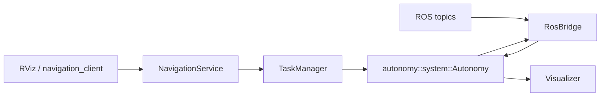

# autonomy_ros 架构

`autonomy_ros` 是 ROS 2 集成层：负责把 ROS 话题/服务/Action 与 `autonomy` core 连接起来。

## 目录结构

```
autonomy_ros/
├── include/autonomy_ros/
│   ├── node.hpp
│   ├── options.hpp
│   ├── constants.hpp
│   ├── bridge.hpp
│   ├── server.hpp
│   ├── manager.hpp
│   ├── visualizer.hpp
│   ├── diagnostic.hpp
│   ├── logger.hpp
│   └── conversions/
├── src/
│   ├── node.cpp
│   ├── options.cpp
│   ├── bridge.cpp
│   ├── server.cpp
│   ├── manager.cpp
│   ├── visualizer.cpp
│   ├── diagnostic.cpp
│   ├── logger.cpp
│   ├── main.cpp
│   └── conversions/*.cpp
├── config/
├── launch/navigation_stack.launch.py
└── scripts/navigation_client.py
```

可执行文件 `autonomy_node` 由 `src/main.cpp` 启动，内部创建 `RosAutonomySystem` 并 `spin`。

## 模块职责

| 模块 | 命名空间 | 职责 |
|------|----------|------|
| `RosAutonomySystem` | `autonomy_ros` | 装配 core、`RosBridge`、`NavigationService`、`Visualizer` |
| `NavigationService` | `autonomy_ros` | `navigate_pose`/`navigate_through` Action，任务控制 Service，RViz 目标入口 |
| `TaskManager` | `autonomy_ros` | 任务状态管理与导航调用（含原任务仲裁逻辑） |
| `RosBridge` | `autonomy_ros` | TF、map、costmap、odom/scan、cmd_vel 的 ROS 侧桥接 |
| `Visualizer` | `autonomy_ros` | 发布 `/plan`、`/navigation_goal`、`/robot_pose` |
| `DiagnosticPublisher` | `autonomy_ros` | 发布 `/diagnostics` 健康信息 |
| `ScopedRosLogSink` | `autonomy_ros` | 将 glog 输出转发到 ROS logger |

## 数据流



## 关键参数

| 参数 | 说明 |
|------|------|
| `autonomy.use_bt_navigation` | 是否使用行为树导航 |
| `autonomy.planner.global_frame` | 规划坐标系（仿真默认 `odom`） |
| `autonomy.enable_scan_bridge` | 是否订阅激光 |
| `navigation.waypoint_timeout_sec` | 导航超时 |
| `navigation.goal_pose_topic` | RViz 目标话题名 |
| `visualization.frame_id` | 可视化 frame |

## 相关文档

- [external_commands.md](external_commands.md)
- [navigation_client.md](navigation_client.md)
- [localization.md](localization.md)
- [conversions.md](conversions.md)
