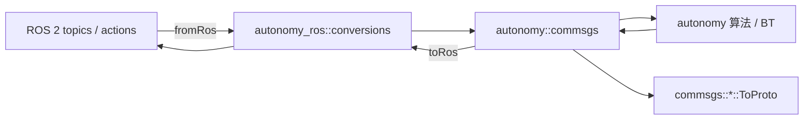

# 消息转换（conversions）

`autonomy_ros::conversions` 是 ROS 2 与 `autonomy` 核心之间的**唯一消息边界**：在 ROS `*::msg::*` 与 `autonomy::commsgs::*` 结构体之间做逐字段拷贝。

- **本模块提供**：`fromRos`（ROS → commsgs）、`toRos`（commsgs → ROS）
- **本模块不提供**：`toProto` / `fromProto（请使用 `autonomy/commsgs` 中各包的 `ToProto` / `FromProto`）

Proto 定义目录：`autonomy/commsgs/proto/*.proto`（与 commsgs 头文件分包一致）。

---

## 入口与用法

```cpp
#include "autonomy_ros/conversions/conversions.hpp"

// 订阅回调：ROS -> 核心
void onMap(const nav_msgs::msg::OccupancyGrid::SharedPtr msg) {
  auto core_map = autonomy_ros::conversions::fromRos(*msg);
  autonomy.onMap(std::make_shared<decltype(core_map)>(core_map));
}

// 发布：核心 -> ROS
auto ros_path = autonomy_ros::conversions::toRos(path);
plan_pub_->publish(ros_path);

// 进入 BT / proto 管线（在 bridge 层之外直接调核心）
auto proto_pose = ::autonomy::commsgs::geometry_msgs::ToProto(goal_com);
```

约定：

| 函数 | 方向 | 说明 |
|------|------|------|
| `fromRos(ros_msg)` | ROS → commsgs | 用于订阅、Action goal、TF 输入等 |
| `toRos(commsg)` | commsgs → ROS | 用于发布、可视化、日志等 |

不做坐标系变换、时间重映射或 TF 语义转换；`frame_id` / `stamp` 原样传递。

---

## 目录结构

```
include/autonomy_ros/conversions/
  conversions.hpp          # 总入口（include 全部子模块）
  builtin_interfaces.hpp
  std_msgs.hpp
  geometry_msgs.hpp
  sensor_msgs.hpp
  map_msgs.hpp
  planning_msgs.hpp
  diagnostic_msgs.hpp
  trajectory_msgs.hpp
  visualization_msgs.hpp
  vision_msgs.hpp
  stereo_msgs.hpp
  shape_msgs.hpp
  pcl_msgs.hpp
  tf2_msgs.hpp
  detail.hpp               # 内部字段拷贝，仅 .cpp 使用

src/conversions/
  <同上>.cpp
  detail.cpp
```

---

## 按 proto 包对照表

| Proto / commsgs 包 | 头文件 | 主要 ROS 依赖 | 已实现类型（摘要） |
|--------------------|--------|---------------|-------------------|
| `builtin_interfaces` | `builtin_interfaces.hpp` | `builtin_interfaces` | Time, Duration |
| `std_msgs` | `std_msgs.hpp` | `std_msgs` | Header, ColorRGBA, MultiArray*, Float32MultiArray, String |
| `geometry_msgs` | `geometry_msgs.hpp` | `geometry_msgs` | Vector3, Point, Pose*, Transform*, Twist*, Accel*, Inertia*, Polygon*, Wrench* 等 |
| `sensor_msgs` | `sensor_msgs.hpp` | `sensor_msgs` | Image, Imu, LaserScan, PointCloud2, CameraInfo, Joy, Range 等 |
| `map_msgs` | `map_msgs.hpp` | `nav_msgs`, `octomap_msgs`, `grid_map_msgs` | OccupancyGrid, GridCells, Octomap*, GridMap* |
| `planning_msgs` | `planning_msgs.hpp` | `nav_msgs` | Odometry, Path |
| `diagnostic_msgs` | `diagnostic_msgs.hpp` | `diagnostic_msgs` | KeyValue, DiagnosticStatus, DiagnosticArray |
| `trajectory_msgs` | `trajectory_msgs.hpp` | `trajectory_msgs` | JointTrajectory*, MultiDOFJointTrajectory* |
| `visualization_msgs` | `visualization_msgs.hpp` | `visualization_msgs` | Marker*, InteractiveMarker* 全套 |
| `vision_msgs` | `vision_msgs.hpp` | `vision_msgs` | Detection*, BoundingBox*, VisionInfo 等 |
| `stereo_msgs` | `stereo_msgs.hpp` | `stereo_msgs` | DisparityImage |
| `shape_msgs` | `shape_msgs.hpp` | `shape_msgs` | Plane, SolidPrimitive, Mesh |
| `pcl_msgs` | `pcl_msgs.hpp` | `pcl_msgs` | Vertices, ModelCoefficients, PointIndices, PolygonMesh（本地 commsgs 占位类型） |
| — | `tf2_msgs.hpp` | `tf2_msgs` | `TransformStampeds` ↔ `TFMessage` |
| `vehicle_msgs` | — | — | proto 为空消息，无转换 |

---

## 未提供 ROS 转换的类型

以下在 commsgs / proto 中有定义，但**没有**对应的标准 ROS 2 消息，故不在 `conversions` 中实现：

**planning_msgs**

- Path2D, Point2D, Twist2D, Pose2DStamped
- Goals, SpeedLimit, CostmapFilterInfo

**geometry_msgs**

- VelocityStamped, PointENU, PointLLH

**vehicle_msgs**

- RobotEvent, RobotState（空消息体）

若需与上位机交互，可扩展 `autonomy_msgs` 或在本目录新增专用头文件。

---

## 特殊说明

### planning_msgs::Odometry 与 nav_msgs::Odometry

核心侧 `planning_msgs::Odometry` 与 ROS `nav_msgs/Odometry` 字段对应；`PlatformBridge`、`Autonomy` 等均通过 `conversions::fromRos` 注入 `OdomSmoother`。

### map_msgs::OccupancyGrid

与 `nav_msgs/OccupancyGrid` 互转；`MapBridge` 在订阅 `/map` 与向 ROS 回发静态图时使用。

### pcl_msgs

`autonomy/commsgs/pcl_msgs.hpp` 尚无 C++ 结构体；`pcl_msgs.hpp` 内 `pcl_msgs_commsgs::*` 与 proto 字段对齐，并与 `pcl_msgs` ROS 包互转。核心库补齐 commsgs 后，可改为直接使用 `commsgs::pcl_msgs`。

### shape_msgs 命名空间

`shape_msgs.hpp`（commsgs）中 Plane / Mesh 等类型位于 `commsgs::builtin_interfaces` 命名空间（历史布局）；转换 API 仍通过 `conversions::Plane` 等别名暴露。

### tf2_msgs

`TransformStampeds`（commsgs）与 `tf2_msgs/TFMessage` 互转；单条 `TransformStamped` 见 `geometry_msgs.hpp`。`TfBridge` 当前仍直接写入 `autonomy::transform::Buffer` 内部格式，可按需改为 `fromRos` + 核心 TF API。

### CameraInfo 字段映射

`sensor_msgs/CameraInfo` 与 commsgs 在部分 binning / ROI 字段名上存在差异，转换层已做显式映射（见 `sensor_msgs.cpp` 实现）。

---

## 在架构中的位置



典型调用点：

| 模块 | 转换示例 |
|------|----------|
| `MapBridge` | `fromRos(OccupancyGrid)`, `toRos(OccupancyGrid)` |
| `PlatformBridge` | `fromRos(Odometry)`, `toRos(TwistStamped)` |
| `Autonomy` | `fromRos(PoseStamped)`, `toRos(Path)` |
| `CommandInterface` | 可逐步改为 `fromRos` / `toRos` 统一边界 |

---

## 扩展新类型

1. 在 `autonomy/commsgs` 与 `proto` 中已有或新增结构体  
2. 确认 ROS 消息包与字段可一一对应  
3. 在 `include/autonomy_ros/conversions/<pkg>.hpp` 声明 `fromRos` / `toRos`  
4. 在 `src/conversions/<pkg>.cpp` 实现（复用 `detail::*`）  
5. 在 `conversions.hpp` 中 `#include` 新头文件  
6. `CMakeLists.txt` / `package.xml` 增加 ROS 依赖  

---

## 相关文档

- [architecture.md](architecture.md) — 包整体架构与模块职责  
- [external_commands.md](external_commands.md) — 外部指令与 Topic  
- [autonomy_msgs README](../../autonomy_msgs/README.md) — 展厅专用 `autonomy_msgs`（非 commsgs 通用转换）
