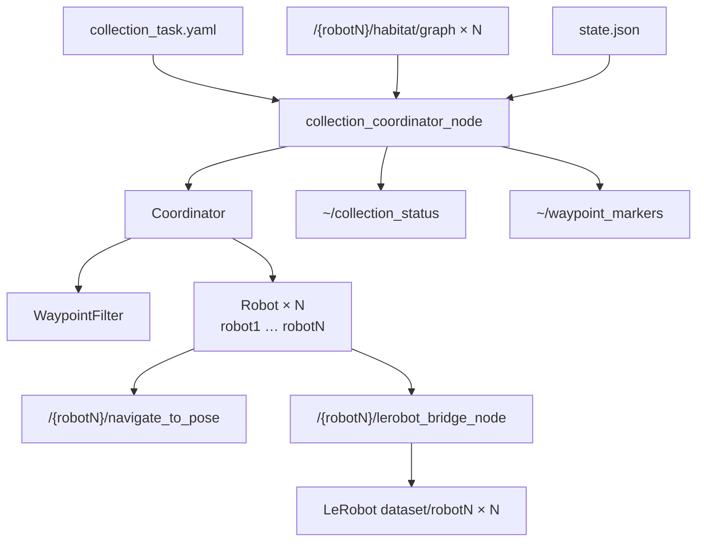

# autonomy_task

多机器人导航与数据采集编排包。从 Habitat 图节点选路、分配 Nav2 目标、控制 LeRobot 录制，并将采集进度持久化到 `state.json`。

## 包结构

```
autonomy_task/
├── config/
│   └── collection_task.yaml      # 主配置
├── launch/
│   └── multi_robot_collection.launch.py
├── autonomy_task/
│   ├── node.py                   # collection_coordinator_node
│   ├── coordinator.py            # 多机调度、状态持久化
│   ├── robot.py                  # Nav2 + 录制客户端（每台机器人）
│   ├── waypoint_filter.py        # 路点过滤与分桶选点
│   ├── state.py                  # state.json 读写
│   ├── dataset_cleanup.py        # 清理 LeRobot 残留 tmp* 目录
│   ├── trajectory_stats.py       # 轨迹与 LeRobot 统计
│   └── collection_stats_cli.py   # 命令行统计工具
└── test/
```

## 架构



**职责划分**

| 组件 | 职责 |
|------|------|
| `Coordinator` | 路点分配、采集计数、写入 `state.json` |
| `Robot` | 单机器人状态机：预热录制 → 导航 → 后录制 → **同步**停录保存 |
| `WaypointFilter` | 距离/分桶/多机间距/地图边界过滤 |
| `lerobot_bridge_node` | 10 Hz 采帧，`save_episode` 写 parquet + mp4 |
| `dataset_cleanup` | 启动时删除数据集根目录下孤立的 `tmp*` 编码缓存 |

## 单机器人采集流程

```
IDLE → PRE_RECORD → NAV → POST_RECORD → (sync stop + save) → IDLE
        0.5s 预热      Nav2      1.0s 后录      等待 LeRobot 落盘
```

**成功路径（导航到达且 LeRobot 保存成功）**

1. 分配路点，`set_recording(true)` 开始预热录制  
2. 发送 `navigate_to_pose`  
3. 到达后继续保持录制 `record_after_arrival_sec`  
4. `set_recording(false)` **同步等待** `save_episode`（默认最长 120 s）  
5. 写入 `state.json`，路点回到 `pending`（`allow_revisit: true`）或标记 `collected`

**失败路径**

| 事件 | 行为 |
|------|------|
| Nav2 abort / 超时 / 卡住 | 取消导航，立即换点重试（`max_retries` 内） |
| LeRobot 保存失败 (`save_failed`) | **不写入** `state.json`，按失败重试 |
| 分桶下无可用路点 | 先尝试其他距离桶，再 fallback 不限桶；仍无则 `relax_peer` 解困 |

达到 `target_episodes` 后等待**所有在途机器人**完成当前 episode，再停止分配。

### 多机并行（N 台同时工作）

| 机制 | 说明 |
|------|------|
| `parallel: true` | 每个 tick 为**所有** idle 机器人分配路点 |
| `min_peer_spacing_m` | 多机目标间距（5 机建议 `1.0`） |
| `stuck_assign_sec` | 15 s 无点可分配 → 放宽 peer 间距 |
| `stuck_reposition_sec` | 30 s 仍无点 → 导航到**最远可达**路点（换区采集） |
| `bucket` + fallback | 分桶优先，本地无点时自动放宽距离桶 |
| `SAVING` 阶段 | 导航结束与 LeRobot 落盘解耦，减少多机互相阻塞 |

**推荐 launch（5 机示例）：**

```bash
ros2 launch autonomy_task multi_robot_collection.launch.py \
  num_robots:=5 \
  use_rviz:=true
```

启用 Habitat 动态行人（默认关闭）：

```bash
ros2 launch autonomy_task multi_robot_collection.launch.py \
  num_robots:=1 \
  use_rviz:=true \
  pedestrians_enabled:=true \
  pedestrian_count:=5
```

`num_robots` 由 launch 覆盖 yaml 中的 `num_robots`；每台机器人独立 graph、map、LeRobot 目录（`dataset_root/robotN`）。

## 路点状态

| 状态 | 含义 | RViz 颜色 |
|------|------|-----------|
| `pending` | 待分配 | 黄色 |
| `in_progress` | 正在前往 | 蓝色 |
| `collected` | 已采集（`allow_revisit: false` 时） | 绿色 |
| `failed` | 超过最大重试 | 红色 |
| `skipped` | 滤除或永久跳过 | 灰色 |
| `blocked` | 预留 | 紫色 |

## 配置

主文件：`config/collection_task.yaml`

### 采集与选点 (`collection`)

| 参数 | 默认 | 说明 |
|------|------|------|
| `target_episodes` | `2000` | 目标条数；`0` = 采完可分配点即停 |
| `allow_revisit` | `true` | 允许重复访问同一图节点 |
| `spacing_vs_collected` | `false` | 是否用历史采集位置做间距过滤 |
| `min_distance_m` / `max_distance_m` | `1.0` / `20.0` | 相对机器人位姿的分配距离范围 |
| `min_spacing_m` | `0.5` | 与已采集点的最小间距（`spacing_vs_collected: true` 时生效） |
| `min_peer_spacing_m` | `1.5` | 多机之间目标点最小间距 |
| `dedupe_radius_m` | `0.3` | 加载图时合并过近节点 |
| `assignment_strategy` | `bucket` | `nearest` / `farthest` / `dispersed` / `bucket` |
| `distance_buckets` | `1–2m … 15–20m` | 分桶均衡采集 |
| `stuck_assign_sec` | `15.0` | 无点可分配时放宽 peer 间距（秒） |
| `stuck_reposition_sec` | `30.0` | 仍无点时导航到最远路点换区（秒） |
| `parallel` | `true` | 多机并行，每台 idle 机器人独立分配 |
| `max_retries` | `2` | 单点最大重试次数 |
| `record_before_nav_sec` | `0.5` | 导航前预热录制时长 |
| `record_after_arrival_sec` | `1.0` | 到达后继续录制时长 |

### 导航 (`navigation`)

| 参数 | 默认 | 说明 |
|------|------|------|
| `stall_sec` | `12.0` | 无进展则取消并重分配 |
| `max_nav_sec` | `40.0` | 单点导航硬超时 |
| `goal_tolerance_m` | `0.35` | 到达判定半径 |

### 录制 (`recording`)

| 参数 | 默认 | 说明 |
|------|------|------|
| `enabled` | `true` | 是否调用 `lerobot_bridge_node` |
| `bridge_basename` | `lerobot_bridge_node` | 桥接节点名 |
| `save_timeout_sec` | `120.0` | 等待 `save_episode`（含视频编码）超时 |
| `cleanup_tmp_on_start` | `true` | 启动时清理 `data/lerobot/.../tmp*` 残留 |

### 其他

| 参数 | 说明 |
|------|------|
| `state_file` | 采集进度 JSON（默认 `data/collection/state.json`） |
| `waypoint_source: graph` | 从 `/{robot}/habitat/graph` 加载路点 |
| `filter.enforce_map_bounds` | 用静态 map 裁剪越界目标 |

数据集路径由 launch 参数 `dataset_root`、`dataset_repo_id` 传入 coordinator，多机时写入 `dataset_root/robotN/`。

**LeRobot 环境**：Docker / 工作区镜像已预装 **lerobot 0.4.4**（无需 `pip install`）。数据回放、训练与深度清理见 [`autonomy_lerobot` README](../autonomy_tools/autonomy_lerobot/README.md#数据回放与使用)。

## 构建与启动

**数据盘**：MP3D 场景默认路径为 `/mnt/data4t/Datasets/mp3d/17DRP5sb8fy`（见 `autonomy_lerobot/config/data_paths.yaml`）。可通过环境变量 `AUTONOMY_MP3D_SCENE` 或 launch 参数 `scene_data_path` 覆盖。场景目录需包含 `{scene_id}.glb`、`.house`、`.navmesh` 及 `{scene_id}_semantic.ply`（语义点云未下载完成时仅影响地图/点云发布，不影响 GLB 加载）。

```bash
colcon build --packages-select autonomy_simulator autonomy_ros autonomy_task --symlink-install
source install/setup.bash
```

### 一键启动（推荐）

```bash
ros2 launch autonomy_task multi_robot_collection.launch.py \
  num_robots:=5 \
  use_rviz:=true
```

**带动态行人（Habitat humanoid）：**

```bash
ros2 launch autonomy_task multi_robot_collection.launch.py \
  num_robots:=1 \
  use_rviz:=true \
  pedestrians_enabled:=true \
  pedestrian_count:=5 \
  pedestrian_linear_speed:=1.0 \
  pedestrian_goal_count:=4 \
  humanoid_avatar:=female_2
```

指定多个 avatar 或精确 agent 数量：

```bash
ros2 launch autonomy_task multi_robot_collection.launch.py \
  num_robots:=1 use_rviz:=true \
  pedestrians_enabled:=true \
  human_agent_count:=8 \
  humanoid_avatars:=female_2,male_1
```

常用 launch 参数：

| 参数 | 默认 | 说明 |
|------|------|------|
| `num_robots` | `3` | 机器人数量 |
| `scene_data_path` | `/mnt/data4t/Datasets/mp3d/17DRP5sb8fy` | MP3D 场景目录（可用 `AUTONOMY_MP3D_SCENE` 覆盖） |
| `dataset_root` | `/mnt/data4t/data/lerobot/collection` | LeRobot 根目录（见 `autonomy_lerobot/config/data_paths.yaml`） |
| `dataset_repo_id` | `local/habitat_collection` | 数据集 repo id |
| `recording_enabled` | `true` | 是否启动 bridge |
| `clean_datasets_on_start` | `false` | `true` 时删除已有 `robotN/` 从零开始 |
| `task_config` | 包内 `collection_task.yaml` | 编排配置路径 |
| `habitat_load_sec` | `8.0` | 单台 Habitat Session 预计加载时间 |
| `habitat_load_penalty_sec` | `12.0` | 每多一台机器人额外增加的 Nav2 等待（GPU 争用） |
| `nav2_stagger_sec` | `12.0` | 各机器人 Nav2 错峰间隔 |
| `lerobot_gap_sec` | `15.0` | 最后一台 Nav2 启动后再等多久开 LeRobot |
| `nav_ready_sec` | `45.0` | 最后一台 Nav2 就绪后再开始分配 |

**动态行人**（经 `navigation_nav2_multi.launch.py` 传入 Habitat-Sim，`pedestrians_enabled:=false` 时不生效）：

| 参数 | 默认 | 说明 |
|------|------|------|
| `pedestrians_enabled` | `false` | 是否启用动态 humanoid 行人 |
| `pedestrian_count` | `5` | 行人数量 |
| `human_agent_count` | `0` | 显式 agent 数；`>0` 时覆盖 `pedestrian_count` |
| `pedestrian_linear_speed` | `1.0` | 行走速度 (m/s) |
| `pedestrian_goal_count` | `4` | 每个行人一轮路径的 waypoint 数 |
| `humanoid_avatar` | `female_2` | 未指定列表时的默认 avatar |
| `humanoid_avatars` | `''` | 逗号分隔 avatar 名；空则自动发现全部 |
| `dynamic_actor_kind` | `humanoid` | 动态 actor 类型：`humanoid` \| `robot` |

启动顺序：Habitat（错峰）→ Nav2（错峰）→ LeRobot bridge（在 Nav2 之后）→ coordinator。

### 单独运行编排节点

```bash
ros2 run autonomy_task collection_coordinator_node --ros-args \
  -p config_file:=$(ros2 pkg prefix autonomy_task)/share/autonomy_task/config/collection_task.yaml \
  -p num_robots:=5 \
  -p dataset_root:=/mnt/data4t/data/lerobot/collection \
  -p dataset_repo_id:=local/habitat_collection
```

## 录制控制

自动采集时 **无需手动调服务**：每台机器人在导航前后自动 `set_recording(true/false)`，并在停录时同步等待保存。

### 手动一键录制（调试）

```bash
# 开始（所有机器人）
ros2 service call /collection_coordinator/start_recording std_srvs/srv/Trigger {}

# 停止并保存（所有机器人）
ros2 service call /collection_coordinator/stop_recording std_srvs/srv/Trigger {}
```

### 单机调试

```bash
ros2 service call /robot1/lerobot_bridge_node/set_recording std_srvs/srv/SetBool "{data: true}"
# ... 跑一段导航 ...
ros2 service call /robot1/lerobot_bridge_node/set_recording std_srvs/srv/SetBool "{data: false}"
```

## 数据与统计

### 落盘位置

```
data/
├── collection/state.json          # 采集进度（仅 save 成功后累加）
└── lerobot/collection/
    ├── robot1/
    │   ├── meta/info.json         # total_episodes, total_frames
    │   ├── data/chunk-*/          # parquet
    │   └── videos/                # mp4
    └── robot2/
        └── ...
```

- **`state.json`**：编排层记录（路点、路径长度、机器人、时间）  
- **LeRobot `meta/info.json`**：实际写入磁盘的 episode 数  
- 两者应基本一致；若 `state` 明显多于 LeRobot，多为历史版本未同步保存导致

### 查看统计

```bash
# 可读报告（state + 各 robot LeRobot meta）
ros2 run autonomy_task collection_stats

# 或指定路径
ros2 run autonomy_task collection_stats \
  --state /workspace/autonomy/data/collection/state.json \
  --dataset-root /workspace/autonomy/data/lerobot/collection

# JSON 输出
ros2 run autonomy_task collection_stats --json
```

### 重置数据

```bash
# 仅重置采集进度
rm -f data/collection/state.json

# 清空 LeRobot（launch 等效参数）
ros2 launch autonomy_task multi_robot_collection.launch.py clean_datasets_on_start:=true

# 手动清空
rm -rf data/lerobot/collection/robot*
```

启动时 `cleanup_tmp_on_start: true` 会自动删除各 `robotN/tmp*`（LeRobot 编码中断残留），**不删除**正式 `data/`、`videos/`。

深度清理（删除异常 episode、重编号、重建 `meta/`）：

```bash
ros2 run autonomy_lerobot cleanup_lerobot_dataset.py --dry-run
ros2 run autonomy_lerobot cleanup_lerobot_dataset.py
```

## 话题与服务

节点名：`collection_coordinator`

| 路径 | 类型 | 说明 |
|------|------|------|
| `/collection_coordinator/collection_status` | `std_msgs/String` | JSON 状态 |
| `/collection_coordinator/waypoint_markers` | `visualization_msgs/MarkerArray` | RViz 路点 |
| `/collection_coordinator/start_recording` | `std_srvs/Trigger` | 一键开始录制 |
| `/collection_coordinator/stop_recording` | `std_srvs/Trigger` | 一键停录并保存 |
| `/{robot}/navigate_to_pose` | Nav2 Action | 导航 |
| `/{robot}/lerobot_bridge_node/set_recording` | `std_srvs/SetBool` | 单机录制开关 |

## 常见问题

| 现象 | 处理 |
|------|------|
| `no waypoint (outside_bucket:1-2)` 刷屏 | 更新到最新 `autonomy_task`（含分桶 fallback / `stuck_assign_sec`）；或临时改 `assignment_strategy: dispersed` |
| `lerobot_save_failed` | 检查 bridge 日志、`meta/info.json` episode 索引；重启 launch；`cleanup_lerobot_dataset.py` 或 `rm -rf robotN` 后重采 |
| `state.json` 条数 > LeRobot episodes | 历史数据；新版本仅在 save 成功后写入 state |
| 大量 `tmp*` 目录占磁盘 | 重启 coordinator（`cleanup_tmp_on_start: true`）或手动 `rm -rf data/lerobot/collection/robot*/tmp*` |
| `waiting for graph` / `waiting for map` | 等待 Habitat、Nav2 就绪；可调大 `graph.wait_sec` |
| `collection exhausted` | 降低 `min_spacing_m` / `min_peer_spacing_m`；检查 `min_distance_m` |
| Ctrl-C 中断后 parquet 损坏 | 删除损坏的 `file-*.parquet` 或整目录重建；正常退出以便 bridge `finalize()` |
| `start_recording` 服务无响应 | `colcon build` 后重启；确认服务在 `/collection_coordinator/` 下 |

## 测试

```bash
cd src/autonomy_ros/autonomy_task
python3 -m pytest test/ -q
```

## 依赖关系

| 包 | 作用 |
|----|------|
| `autonomy_ros` | 多机 Habitat + Nav2 launch |
| `autonomy_lerobot` | LeRobot bridge（录制、落盘）；回放/训练 CLI 见该包 README |
| `autonomy_msgs` | Graph 消息 |
