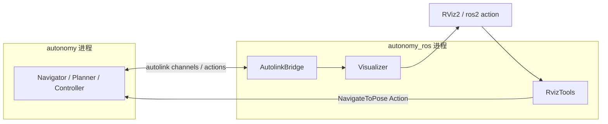

# 架构：进程隔离

| 模块 | 职责 |
|------|------|
| `AutolinkBridge` | autonomy→ROS：`/map` `/plan` `/cmd_vel` `/odom`（传感器由 autodriver 直进 autonomy） |
| `RvizTools` | ROS Action/Service → autolink Action Client |
| `Visualizer` | ROS 可视化话题 |
| `msgs/` | Nav2 风格外部接口定义 |
